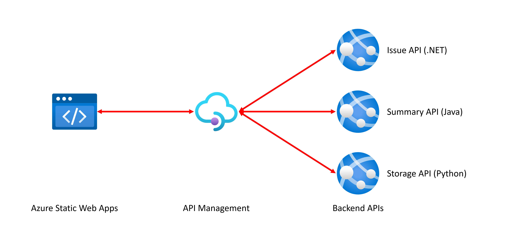
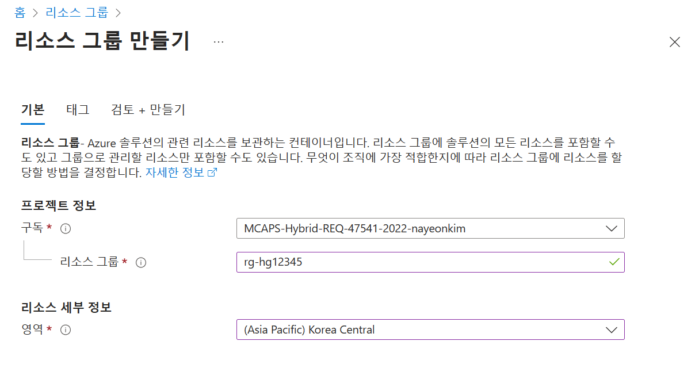
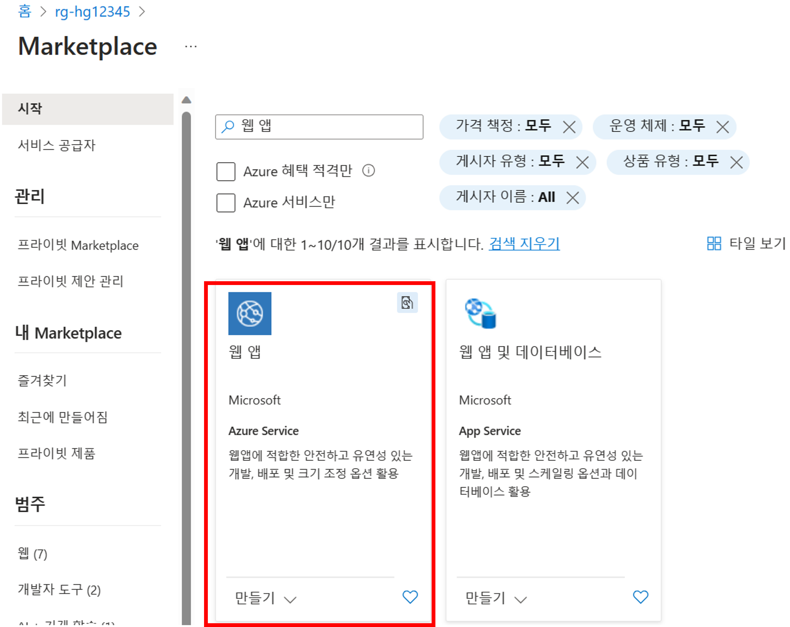
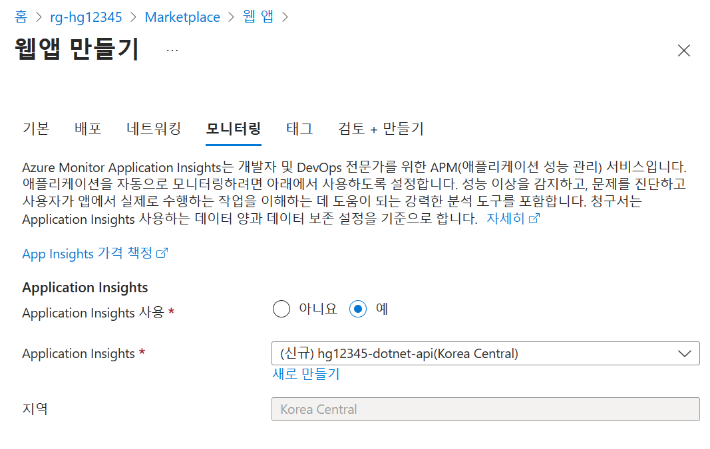
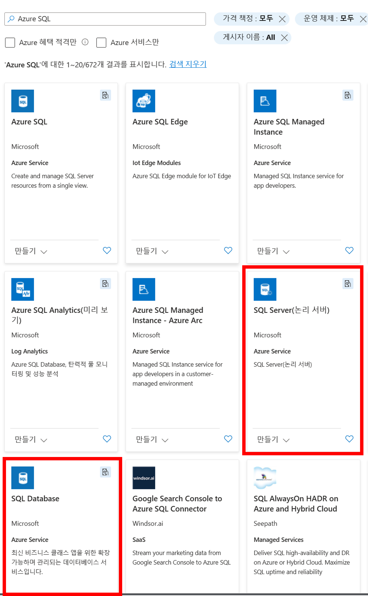
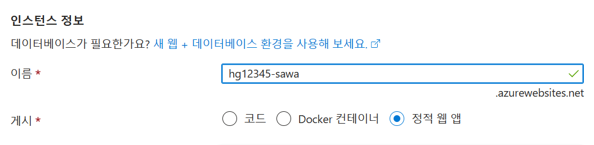

# Azure 포털에서 리소스 생성하기

## 아키텍처

## 프로비저닝
### 리소스 그룹 생성
우리의 리소스를 모아둘 폴더 역할을 할 리소스 그룹을 생성합니다.

리소스 그룹의 이름은 `rg-hg(랜덤숫자조합)`으로 하며, 리소스 그룹의 위치는 `Korea Central`로 합니다.

### 백엔드 API 웹앱 3개

생성된 리소스 그룹에 들어가서 좌측 상단의 `만들기` 버튼을 클릭하여 `웹 앱`을 검색합니다.

<이름>
* Issue API: `hg(랜덤숫자조합)-dotnet-api`
* Chat API: `hg(랜덤숫자조합)-java-api`
* Storage API: `hg(랜덤숫자조합)-python-api`

<게시>
* 3개의 웹 앱 모두 `코드`

<런타임 스택 선택>
* Issue API: `.NET 7`
* Chat API: `Java17`
* Storage API: `Python 3.11`

<운영 체제>
* 모두 `Linux`  

<지역>
* 모두 `Korea Central`

<Linux 플랜>
* 새로 만들기 클릭
* `asplan-hg(랜덤숫자)-dotnet-api` 형식으로 이름 지정
* 가격 책정 플랜 - `기본 B1` 선택
* 각자 앱마다 하나씩 새로 생성

<모니터링>
* Application Insights 사용 - 예
* 자동으로 신규 생성 됨.

  

* 웹 앱을 총 3개 만들어야 함.
  

### AzureSQL 서버와 DB
생성된 리소스 그룹에 들어가서 좌측 상단의 `만들기` 버튼을 클릭하여 `AzureSQL`을 검색합니다.

우리는 여기서 빨간색으로 표시된 서버와 데이터베이스를 생성합니다.

#### AzureSQL 서버 생성
<서버 이름>
* `sqlsvr-hg(랜덤숫자)-python-api`

<인증 방법>
* SQL 인증 사용
* 서버 관리자 이름, 암호 작성
* 관리자 이름과 암호를 알아야 DB 접속 후 확인이 가능하기 때문에 메모해둡니다.

<네트워킹>
* Azure 서비스 및 리소스가 이 서버에 액세스할 수 있도록 허용: `예`

#### AzureSQL 데이터베이스 생성
<데이터베이스 이름>
* `sqldb-hg(랜덤숫자)-python-api`

<서버>
* 서버를 생성한 지 얼마 지나지 않았으면 선택지에 생성되지 않으니 새로고침 후 다시 하도록 합니다.
* 방금 생성한 서버 선택

### Azure API Management
생성된 리소스 그룹에 들어가서 좌측 상단의 `만들기` 버튼을 클릭하여 `API Management`을 검색합니다.

<리소스 이름>
* `apim-hg(랜덤숫자)`

<Organization name과 관리자 메일>
* 자유로 임시값 삽입

### 정적 웹앱

정적 웹앱은 처음 배포한 api 웹앱에서 `게시` 부분을 `정적 웹 앱`으로 선택하면 됩니다.

<이름>
* `sttapp-hg(랜덤숫자)-web`

<배포 세부 정보>
* 기타

<Azure Functions API 및 스테이징 환경을 위한 영역>
* East Asia

다음 👉 [Azure 포털에서 리소스 구성 설정하기](./02-portal-works.md)