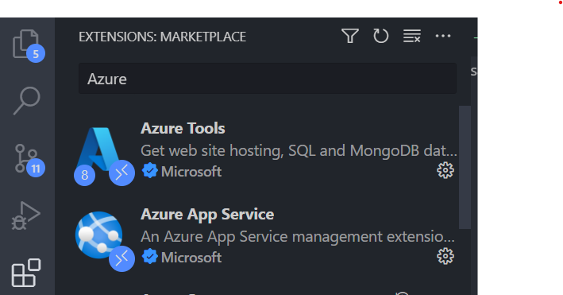
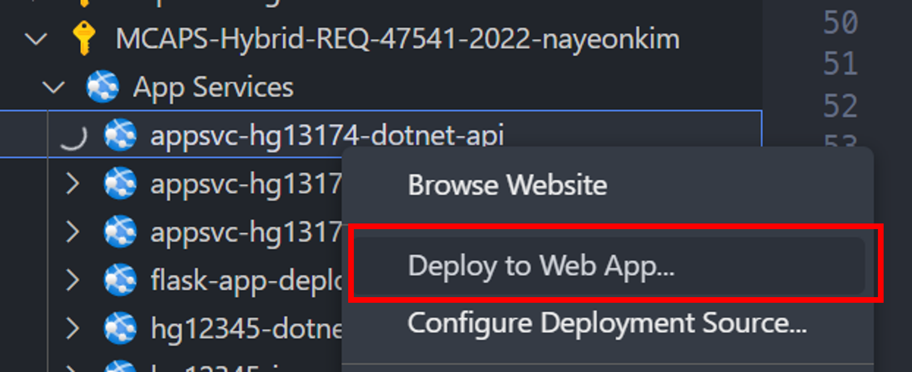

# Visual Studio Code에서 원클릭 배포하기

## 로컬에서 앱 실행하기
세션2의 Codespace를 이용할 때는 모든 언어 구성 팩, 프레임워크나 라이브러가 모두 설치되어 있기 떄문에 간편하게 실행할 수 있습니다. 

하지만 사용자의 로컬 환경에서 이 앱을 모두 실행해서 테스트 하기 위해서는 .NET7, Java17, Python 3.11, Javascript 가 모두 설치 되어 있어야 하며 각 언어에 부합하는 툴체인과 라이브러리도 필요합니다.

그렇기 때문에 이번 세션에서는 Visual Studio Code를 이용하여 바로 배포를 진행 한 후 테스트를 진행합니다.

만약 로컬에서 앱을 실행해 보고 싶다면 아래와 같은 방법을 따릅니다.

1. Issue API .NET 실행
    ```bash
    cd issue-api
    dotnet build
    dotnet run
    ```
2. Chat API Java 실행
    
    `application-dev.properties` 파일 생성
    ```bash
    cd chat-api/src/main/resources
    touch application-dev.properties
    ```

    `application-dev.properties` 파일에 아래 내용 추가
    ```
    AOAI_API_ENDPOINT=https://api.openai.com/v1/chat/completions
    AOAI_API_KEY=API_KEY_HERE
    AOAI_API_DEPLOYMENT_ID=gpt-3.5-turbo

    Auth__ApiKey=apikey
    ```
    스프링 부트 앱 실행
    ```bash
    cd chat-api
    ./mvnw spring-boot:run
    ```
    Chat API는 `/chat-api` 에 추가 `README.md`가 있으니 참고하세요.

3. Storage API Python 실행
   ```bash
    cd storage-api
    python -m venv .venv
    source .venv/bin/activate
    pip install -r requirements.txt
    uvicorn main:app --reload #FastAPI 앱 실행
    ```
4. Frontend React 실행
    ```bash
    cd web
    npm install
    npm run start
    ```

## Azure extension 설치하기

Visual Studio Code에는 무료로 사용할 수 있는 수많은 확장 extension이 있습니다.

우리는 Azure로 원클릭 배포를 하기 위해 Azure extension을 설치합니다.

Visual Studio Code 좌측에 `Extension` 메뉴를 클릭해 `Azure`를 검색합니다.



설치 Extension들:

* Azure Tools
* Azure App Service
* Azure Static Web Apps
* Azure API Management

## API 앱 빌드하기

Python 외 .NET과 Java는 빌드를 통해 결과물을 생성해야 합니다.

* Issue API(.NET) 빌드
  ```bash
  cd issue-api
  dotnet build issue-api -c Release && dotnet publish issue-api -c Release
  ```

* Chat API(Java) 빌드
  ```bash
  cd chat-api
  ./mvnw clean package
  ```

## API 웹 앱 배포하기

본인의 구독 밑에서 포털에서 만들어 둔 앱 서비스를 찾아 마우스 오른쪽을 클릭해 `Deploy to Web App`을 누릅니다.



`Deploy to Web App`을 누르면 아래와 같은 화면이 나옵니다.


여기서 각 앱 서비스에 맞는 경로를 선택합니다. .NET과 Java는 각 build 결과물인 `bin`과 `target` 폴더 안의 결과물을 선택합니다.

* Issue API: `issue-api/bin/Release/net7.0/publish`
* Chat API: `chat-api/target/chat-api-0.0.1-SNAPSHOT.jar`
* Storage API: `storage-api`

## 정적 웹 앱 생성 및 배포하기

정적 웹 앱은 portal에서 코드 배포를 Github Repo로 잡으면서 자동으로 CI/CD workflow가 생성되어 이미 웹 사이트가 배포 되었습니다.

## API Management 설정하기

API Management를 설정하기 위해서는 다시 Azure Portal로 돌아가야 합니다.

Azure Portal에서 APIM으로 접속해 `API` 탭에서 `Add API`를 누릅니다.

각 API 웹 앱에 접속해보면 Swagger UI의 OpenAPI 명세서를 확인할 수 있고, 타이틀 밑에 OpenAPI Specification 링크가 첨부되어 있습니다.


해당 링크를 그대로 복사해서 `OpenAPI Specification URL`에 붙여넣기 합니다.
그러면 자동으로 `Display name`과 `Name`이 채워집니다.

* API URL suffix
  * Issue API: `github`
  * Chat API: `aoai`
  * Storage API: `storage`

### Github Issues API(Issue API) Inbound policy 설정
```xml
<policies>
    <inbound>
        <base />
        <get-authorization-context provider-id="github-issues" authorization-id="github-issues" context-variable-name="auth-context" identity-type="managed" ignore-error="false" />
        <set-header name="x-github-token" exists-action="override">
            <value>@(((Authorization)context.Variables.GetValueOrDefault("auth-context"))?.AccessToken)</value>
        </set-header>
        <set-header name="User-Agent" exists-action="override">
            <value>API Management</value>
        </set-header>
    </inbound>
    <backend>
        <base />
    </backend>
    <outbound>
        <base />
    </outbound>
    <on-error>
        <base />
    </on-error>
</policies>
```
### Chat Completion API(Chat API) Inboud policy 설정
```xml
<policies>
    <inbound>
        <base />
        <set-header name="x-aoai-token" exists-action="override">
            <value>{{AOAI_TOKEN 값 넣기}}</value>
        </set-header>
    </inbound>
    <backend>
        <base />
    </backend>
    <outbound>
        <base />
    </outbound>
    <on-error>
        <base />
    </on-error>
</policies>
```

### Github Issues API(Storage API) policy 설정
설정할 내용 없음

### GithubIssuesSummary 라는 새로운 API 만들기

Open API 명세서 파일 경로: `infra/openapi-bff.yaml`

`새로운 API 추가`에서 `Select a file`로 Open API 명세서 파일을 업로드합니다.

* API URL Suffix: bff

### APIM Github OAuth 인증 설정하기
참고 링크: [Github OAuth 인증 설정하기](https://learn.microsoft.com/en-us/azure/api-management/authorizations-how-to-github)

* 권한 부여 이름: `github-issues`

[Azure Portal에서 리소스 구성하기](./02-portal-works.md) 👈 이전 | 다음 👉 [Bicep & Azure Developer CLI로 한 번에 프로비저닝하기](./04-bicep-azd-provision.md)